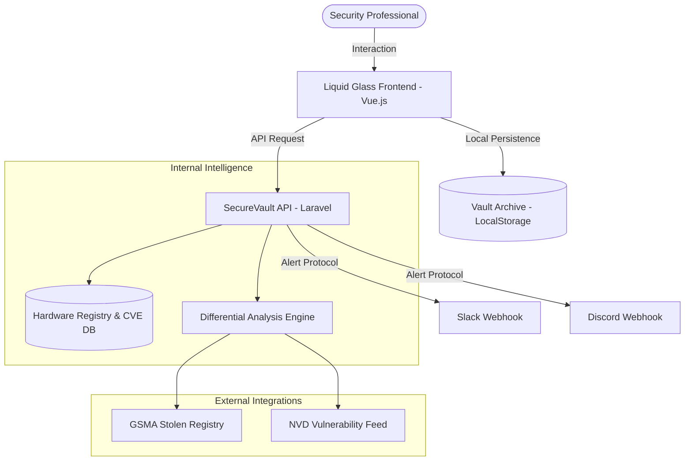
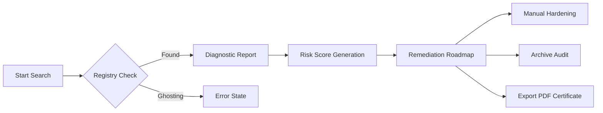

# 🔒 SecureVault Enterprise: Full Fidelity Hardware Integrity Platform


**SecureVault** is a next-generation hardware integrity and security diagnostic platform designed for advanced enterprise fleet management. Built with a stunning **macOS-inspired "Liquid Glass"** aesthetic, it provides security professionals with real-time technical auditing, differential hardware analysis, and cryptographic remediation guides.

## 📊 System Architecture & Data Flow



## 🔄 Audit Lifecycle Flow



---

## 🚀 Key Enterprise Modules

### ⚖️ Differential Analysis (Compare)
The **Differential Analysis** engine allows side-by-side technical auditing of multiple assets.
*   **Delta Reporting**: Identify precise security deltas between different manufacturers (e.g., Apple vs. Samsung).
*   **Procurement Audit**: Evaluate security scores before large-scale hardware deployment.
*   **Registry Intelligence**: Direct integration with manufacturer-specific security registries to verify hardware lifecycle status.

### 🛠️ Remediation Roadmap
Actionable step-by-step guides generated dynamically for every discovered vulnerability.
*   **Kernel Mitigation**: Specific instructions for patching discovered CVEs.
*   **Cryptographic Re-Keying**: Guidance on re-enrolling Secure Enclave keys when biometric drift is detected.
*   **Identity Purge Protocols**: Standard Operating Procedures (SOPs) for wiping sensitive credentials before asset transfer.

### 🔐 Vault Archive
A private, encrypted dashboard for managing historical audits.
*   **Persistence Layer**: Securely store audits in a local-first architecture for maximum privacy.
*   **Audit Labeling**: Tag audits with metadata for fleet categorization.
*   **One-Click Retrieval**: Instantly reload any historical audit into the diagnostic engine.

### 🔔 Global Alert Protocol
Automated security notification system for real-time fleet protection.
*   **Multi-Channel Support**: Native integration with Slack and Discord webhooks.
*   **Intelligence Triggers**: Configure alerts for "New Critical CVEs," "High-Frequency Attack Origins," and "Unauthorized Status Modifications."
*   **Integrity Testing**: Automated heartbeat checks for configured webhook endpoints.

---

## 🎨 Design Philosophy: "Liquid Glass"

The application utilizes a proprietary **Liquid Glass UI**, engineered for high-performance visual fidelity:

*   **Glassmorphism Engine**: Utilizes advanced `backdrop-filter: blur()` treatments combined with multi-layered border logic to create a premium depth effect.
*   **High-Contrast Dark Mode**: The "Midnight" theme uses a curated palette of deep charcoals and indigo accents for zero-strain professional use.
*   **Micro-Animation Layer**: Physics-based transitions for modals, search suggestions, and charts ensure the interface feels alive.
*   **Typography High-Fidelity**:
    *   **Mona Sans**: A variable font designed for clarity in high-density data dashboards.
    *   **Mona Sans Mono**: Utilized for cryptographic hashes, CVE IDs, and technical logs.

---

## 💻 Technical Architecture

### Component Hierarchy (Frontend)
SecureVault follows a strict modular component architecture:
*   `BrandLogo.vue`: High-fidelity SVG rendering engine for manufacturer recognition.
*   `CveTable.vue`: Sortable, expandable technical data grid for vulnerability analysis.
*   `RiskScoreBadge.vue`: Dynamic visual indicator for aggregate device security health.
*   `StolenStatusComponent.vue`: Integration with global stolen-device registries (GSMA, etc.).

### Navigation Flow
1.  **Landing Page**: Predictive search powered by the Unified Asset Registry.
2.  **Report Page**: Full-fidelity diagnostic report including charts, roadmap, and QR verification.
3.  **Device Browser**: Enterprise fleet view with advanced lifecycle filtering.
4.  **Admin Dashboard**: Central command center for fleet stats and alert protocols.

---

## 📡 API Documentation & Integrations

The SecureVault backend provides a RESTful interface for external security tool integration.

### Endpoint: Check Device Integrity
`GET /api/devices/check?q={query}`

**Response Format:**
```json
{
  "status": "success",
  "data": {
    "device": {
      "model_name": "iPhone 15 Pro",
      "brand": "Apple",
      "security_score": 92,
      "security_status": "SUPPORTED"
    },
    "vulnerabilities": [
      {
        "cve_id": "CVE-2024-23222",
        "severity": "CRITICAL",
        "description": "Kernel memory corruption mitigated in iOS 17.3."
      }
    ]
  }
}
```

### Endpoint: Alert Protocol Configuration
`POST /api/alerts/configure`
*   Payload: `{"channel": "SLACK", "webhook_url": "...", "trigger": "CRITICAL_CVE"}`

---

## ⚙️ Installation & Deployment

### Global Prerequisites
- **Node.js** v18.0.0 or higher
- **PHP** v8.2.0 or higher (with BCMath, Ctype, Fileinfo, MBString extensions)
- **Composer** v2.5 or higher
- **Git** v2.4 +

### Deployment Sequence

1. **Initialize Core Repository**
   ```bash
   git clone https://github.com/your-org/securevault.git
   cd securevault
   ```

2. **Backend Architecture Prep**
   ```bash
   cd backend
   composer install
   cp .env.example .env
   php artisan key:generate
   php artisan migrate --seed
   php artisan serve
   ```

3. **Frontend Visual Layer Prep**
   ```bash
   cd ../frontend
   npm install
   npm run dev
   ```

---

## 🛡️ Security Policy
*   All diagnostics are performed against verified hardware registries.
*   Private audit data stored in the **Vault Archive** never leaves the local environment without explicit export.
*   API integration requires an enterprise-level Bearer token (configurable in Admin Dashboard).

---

## 🤝 Contributing
Contributions are welcome. Please ensure all UI changes adhere to the **Liquid Glass** design tokens defined in `tailwind.config.js`.

---
*SecureVault is for professional security use only. Maintain hardware ethics at all times.*
